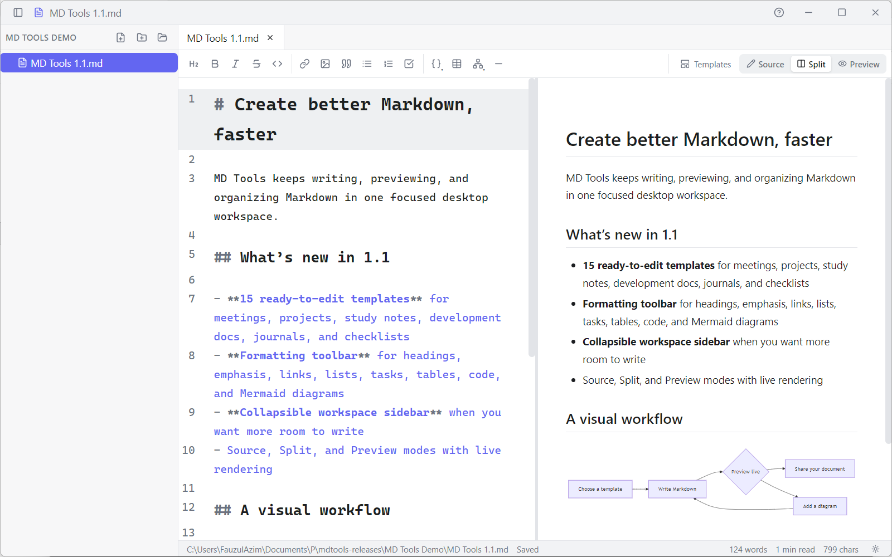
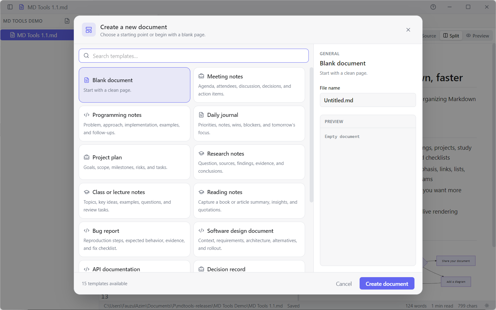

# MD Tools — Releases

Download ready-to-use Windows builds of **MD Tools 1.2**, a focused desktop workspace for writing
Markdown and working with common document formats.

## Download

Get the newest build from the **[latest release](../../releases/latest)**:

- **`MD.Tools-Setup-x.x.x.exe`** — standard installer (recommended), with Start Menu and Desktop shortcuts
- **`MD.Tools-Portable-x.x.x.exe`** — portable app; run it without installing

Both packages target **64-bit Windows**. The builds are currently unsigned, so Windows SmartScreen
may show “Windows protected your PC” the first time you open one. Choose **More info → Run anyway**
if you downloaded the file from this repository.

## What’s new in 1.2

- Edit Markdown, plain-text, JSON, and source-code files in one workspace
- Preview images, PDFs, Word documents (`.docx`), Excel workbooks (`.xlsx` / `.xlsm`), and CSV tables
- Export a rendered Markdown document—including syntax highlighting and Mermaid diagrams—to PDF
- Use language-aware editing and JSON syntax support for non-Markdown text files
- Render useful inline HTML safely while removing scripts, event handlers, forms, embedded pages, and inline styles
- Create new Markdown, TXT, or JSON documents from the document picker

See [CHANGELOG.md](CHANGELOG.md) for the complete history from 1.0 onward.

## Core features

- Browse a workspace and create, rename, or delete files and folders from the sidebar
- Edit Markdown in **Source**, **Split**, or **Preview** mode with live Mermaid rendering
- Format headings, emphasis, links, lists, tasks, tables, code, and diagrams from the toolbar
- Start quickly with **15 built-in templates** for meetings, projects, study, development, journals, and more
- Work across tabs with autosave and protection for unsaved changes
- Fuzzy-search every workspace file with Quick Open (`Ctrl+P`)
- Collapse the sidebar when you want more writing space (`Ctrl+Shift+B`)
- Choose a light, dark, or system theme
- Open the built-in Markdown, Mermaid, and keyboard-shortcut guide (`Ctrl+/`)

## Document support

| Format | Support |
| --- | --- |
| Markdown (`.md`, `.markdown`, `.mdx`) | Edit, live preview, templates, Mermaid, PDF export |
| Text and JSON (`.txt`, `.json`) | Edit and autosave |
| Source code | Edit with language-aware highlighting |
| CSV (`.csv`) | Read-only table preview |
| Images and PDF | Read-only preview |
| Word (`.docx`) | Read-only converted document preview |
| Excel (`.xlsx`, `.xlsm`) | Read-only multi-sheet table preview |

## Document templates

Press `Ctrl+N` to create a document from a ready-to-edit template, or `Ctrl+Shift+T` to apply one to
the current Markdown document. MD Tools asks for confirmation before replacing existing content.

## Getting started

1. Install MD Tools, or open the portable executable.
2. Open a folder with `Ctrl+O`; that folder becomes your workspace.
3. Select a supported file in the sidebar, or press `Ctrl+N` to create a document.
4. For Markdown, choose Source, Split, or Preview mode from the editor toolbar.
5. Keep writing—editable files save shortly after you stop typing, or immediately with `Ctrl+S`.

## Keyboard shortcuts

| Shortcut | Action |
| --- | --- |
| `Ctrl+N` | New document from a template |
| `Ctrl+O` | Open folder |
| `Ctrl+S` | Save current file |
| `Ctrl+W` | Close current tab |
| `Ctrl+P` | Quick Open |
| `Ctrl+Tab` / `Ctrl+Shift+Tab` | Next / previous tab |
| `Ctrl+Shift+B` | Show / hide the sidebar |
| `Ctrl+Shift+T` | Apply a template to the current Markdown document |
| `Ctrl+,` | Cycle system / light / dark theme |
| `Ctrl+/` | Toggle in-app help |

Maintainers: see [RELEASE.md](RELEASE.md) for the release and changelog commands.
