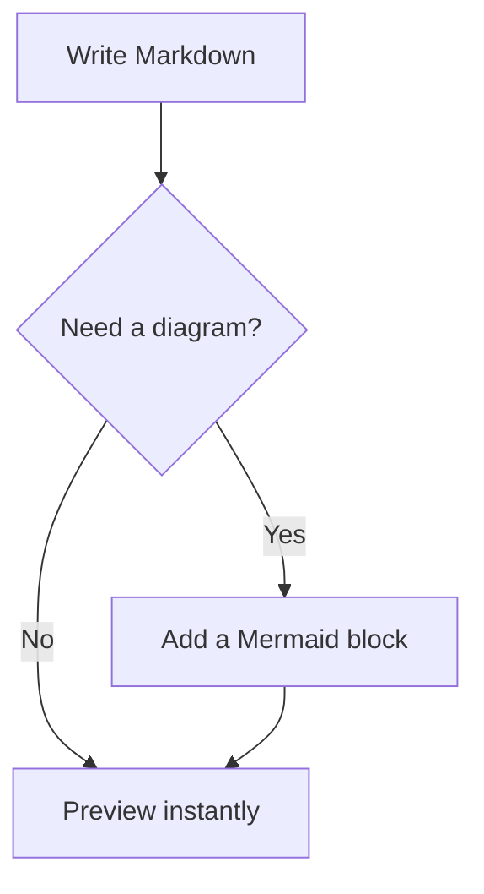

# MD Tools — Releases

Download ready-to-use Windows builds of **MD Tools**, a focused desktop app for browsing, writing,
and previewing Markdown—with built-in Mermaid diagrams, document templates, and a formatting toolbar.


## Download

Get the newest build from the **[latest release](../../releases/latest)**:

- **`MD Tools-Setup-x.x.x.exe`** — standard installer (recommended), with Start Menu and Desktop shortcuts
- **`MD Tools-Portable-x.x.x.exe`** — portable app; run it without installing

Both packages target **64-bit Windows**. The builds are currently unsigned, so Windows SmartScreen
may show “Windows protected your PC” the first time you open one. Choose **More info → Run anyway**
if you downloaded the file from this repository.

## Features

- Browse a workspace and create, rename, or delete files and folders from the sidebar
- Edit in **Source**, **Split**, or **Preview** mode with live Markdown and Mermaid rendering
- Format headings, emphasis, links, lists, tasks, tables, code, and diagrams from the toolbar
- Start quickly with **15 built-in templates** for meetings, projects, study, development, journals, and more
- Work across tabs with autosave and protection for unsaved changes
- Fuzzy-search every workspace file with Quick Open (`Ctrl+P`)
- Collapse the sidebar when you want more writing space (`Ctrl+Shift+B`)
- Choose a light, dark, or system theme
- Open the built-in Markdown, Mermaid, and keyboard-shortcut guide (`Ctrl+/`)

## Document templates

Press `Ctrl+N` to create a document from a ready-to-edit template, or `Ctrl+Shift+T` to apply one to
the current document. MD Tools asks for confirmation before replacing existing content.


## Markdown and Mermaid

MD Tools renders headings, emphasis, links, blockquotes, task lists, tables, and fenced code blocks.
Syntax highlighting is included for JavaScript/TypeScript, Python, Bash, JSON, HTML, CSS, YAML,
C++, Java, and SQL.

Use a fenced `mermaid` block to render flowcharts, sequence diagrams, Gantt charts, state diagrams,
and more directly in Split or Preview mode:

````markdown

````

## Getting started

1. Install MD Tools, or open the portable executable.
2. Open a folder with `Ctrl+O`; that folder becomes your workspace.
3. Select a Markdown file in the sidebar, or press `Ctrl+N` to create one from a template.
4. Choose Source, Split, or Preview mode from the editor toolbar.
5. Keep writing—changes save shortly after you stop typing, or immediately with `Ctrl+S`.

## Keyboard shortcuts

| Shortcut | Action |
| --- | --- |
| `Ctrl+N` | New document from a template |
| `Ctrl+O` | Open folder |
| `Ctrl+S` | Save current file |
| `Ctrl+W` | Close current tab |
| `Ctrl+P` | Quick Open |
| `Ctrl+Tab` / `Ctrl+Shift+Tab` | Next / previous tab |
| `Ctrl+Shift+B` | Show / hide the sidebar |
| `Ctrl+Shift+T` | Apply a template to the current document |
| `Ctrl+,` | Cycle system / light / dark theme |
| `Ctrl+/` | Toggle in-app help |
