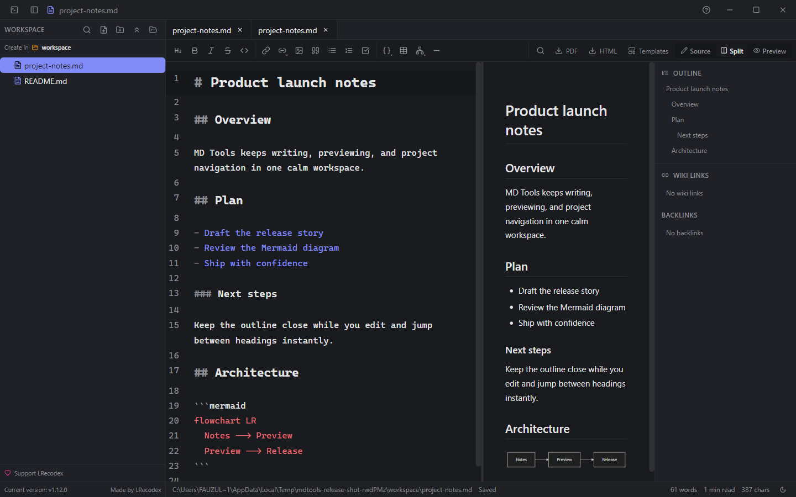
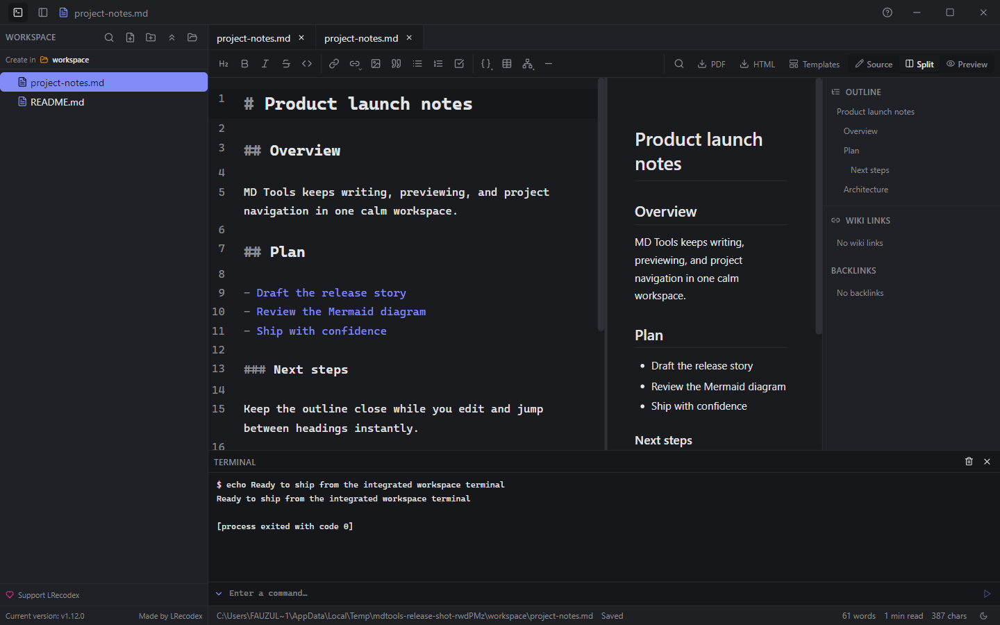

# MD Tools

### A calm, capable Markdown workspace for Windows

Write in Markdown, preview it instantly, navigate a whole project, render Mermaid diagrams, and run your favorite coding CLI tools without leaving the app.

## See it in action

The split editor keeps your source, rendered preview, and clickable outline together. Click any heading in the outline to jump straight to it.

The integrated terminal runs commands in your workspace and streams output live. Use Claude, Codex, Git, npm, or any other CLI alongside your notes and files.

## Why MD Tools

- **Write and see the result immediately** — Source, Split, and Preview modes with Mermaid diagrams and syntax highlighting.
- **Navigate large workspaces quickly** — Resizable, hideable sidebar; tabs; Quick Open search; clickable document outline; wiki links and backlinks.
- **Stay in flow** — Integrated terminal with live output, stop/clear controls, and `Ctrl+J` toggle.
- **Edit real project files** — Autosave, CodeMirror editing, formatting toolbar, templates, and support for text, JSON, code, CSV, images, PDF, Word, and Excel previews.
- **Ship confidently** — Dark/light/system themes, PDF/HTML export, responsive layout, and user-controlled update checks.

## Download

Open the **[latest release](../../releases/latest)** and choose one:

- **`MD-Tools-Setup-x.x.x.exe`** — standard installer with shortcuts.
- **`MD-Tools-Portable-x.x.x.exe`** — run without installing.

Both packages target 64-bit Windows. Builds are currently unsigned, so Windows SmartScreen may show a warning on first launch. Choose **More info → Run anyway** only when the file came from this repository.

## v1.12.0 highlights

- Outline headings now navigate in both editor and rendered preview.
- Integrated workspace terminal for Claude, Codex, Git, npm, and other CLI tools.
- Live terminal output with process stop and clear controls.
- Sidebar visibility and width controls remain available from the title bar and Settings.

See [CHANGELOG.md](CHANGELOG.md) for the full release history.

## Keyboard shortcuts

| Shortcut | Action |
| --- | --- |
| `Ctrl+N` | New document from a template |
| `Ctrl+P` | Quick Open workspace search |
| `Ctrl+Shift+P` | Command Palette |
| `Ctrl+F` | Find in the current document |
| `Ctrl+Shift+B` | Show / hide sidebar |
| `Ctrl+J` | Show / hide terminal |
| `Ctrl+S` | Save current file |
| `Ctrl+Tab` | Switch tabs |
| `Ctrl+,` | Cycle theme |

## Updating

Installed builds check this repository for the newest GitHub Release and let you download and install updates when ready.

## Source code

The application source is maintained at **[LRecodex/mdtools](https://github.com/LRecodex/mdtools)**. This repository is dedicated to downloadable Windows builds and release notes.

Maintainers: see [RELEASE.md](RELEASE.md) for release commands.
